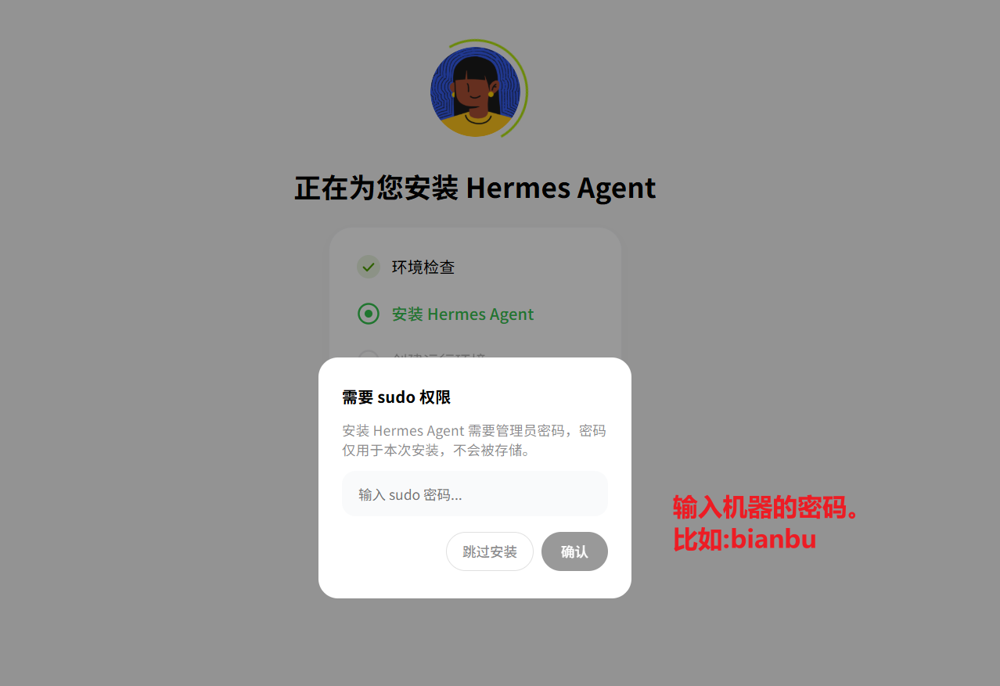
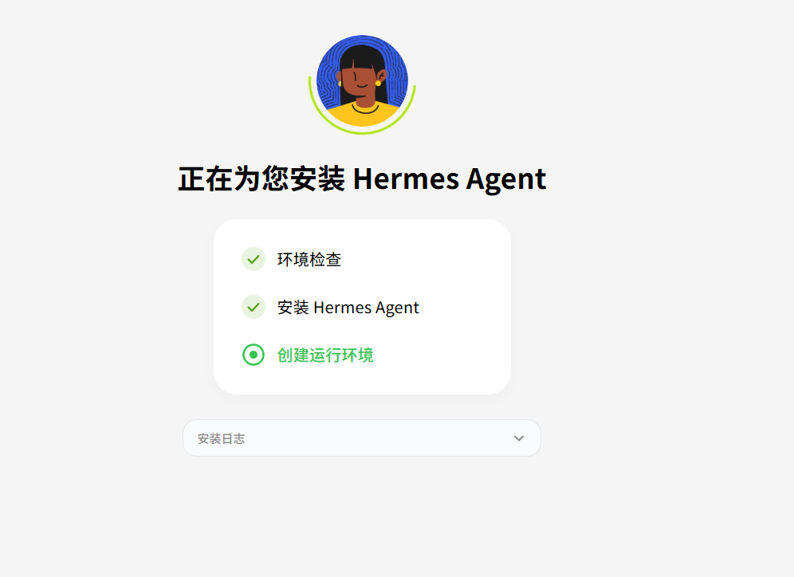
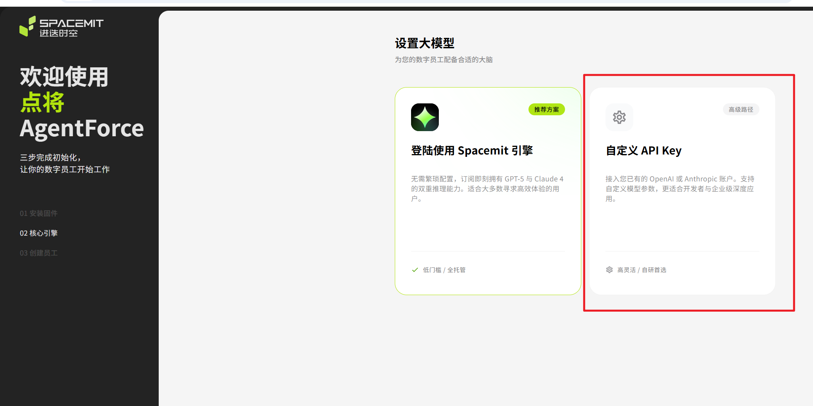
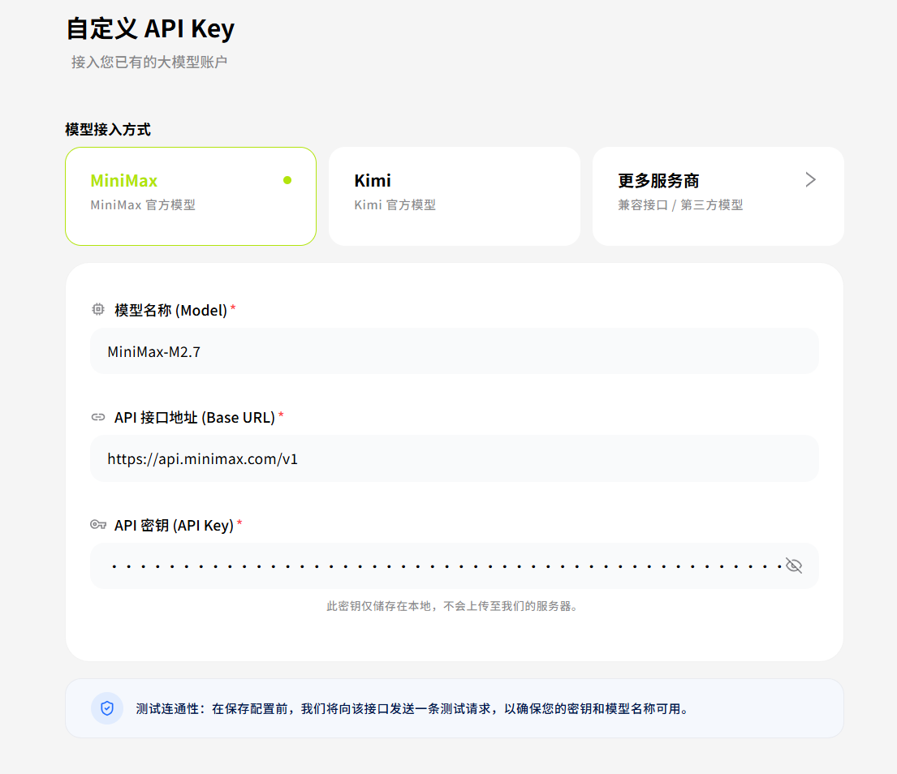
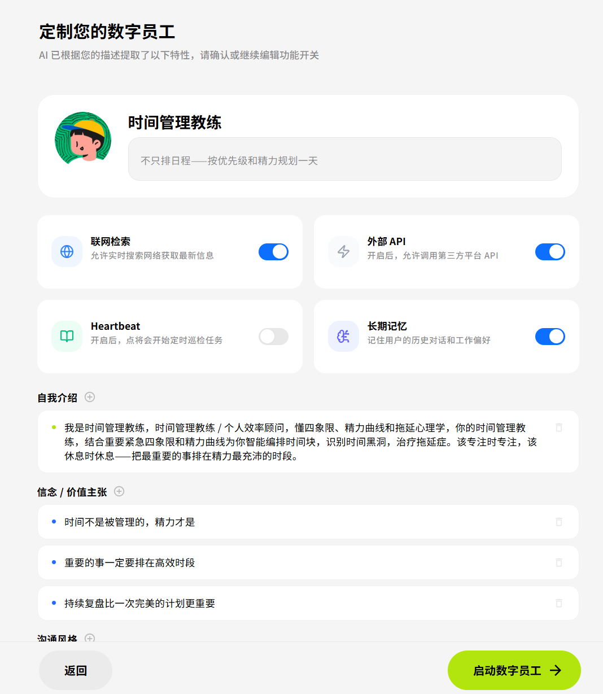
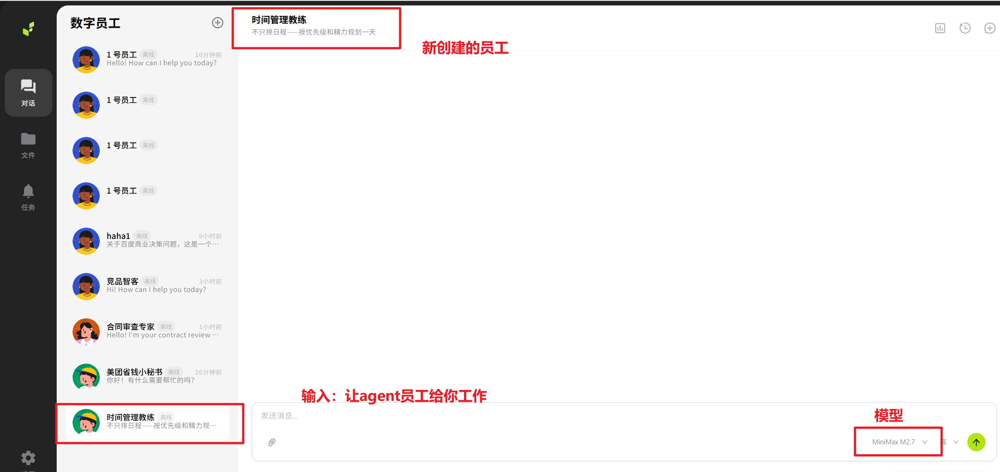

<!--
 * Copyright 2022-2023 SPACEMIT. All rights reserved.
 * Use of this source code is governed by a BSD-style license
 * that can be found in the LICENSE file.
 * 
 * @Author: David(qiang.fu@spacemit.com)
 * @Date: 2026-05-12 20:12:39
 * @LastEditTime: 2026-05-16 00:00:00
 * @FilePath: \doc\docs-ai\en\solutions\aicomputer_solution\agentforce.md
 * @Description: 
-->
sidebar_position: 4

# AgentForce

**AgentForce** is an AI digital employee management platform built on Hermes Agent and OpenClaw. It provides a visual web interface for creating, managing, and interacting with multiple AI digital employees. Each employee has an independent personality, memory, and skill set, with autonomous learning and task execution capabilities.

## Platform Support

| Platform & OS         | Supported |
| --------------------- | --------- |
| K1 Buildroot          | ❌ No     |
| K1 OpenHarmony        | ❌ No     |
| K1 Bianbu LXQT/GNOME  | ❌ No     |
| K3 Buildroot          | ❌ No     |
| K3 OpenHarmony        | ❌ No     |
| K3 Bianbu LXQT/GNOME  | ✅ Yes    |

## Key Features

- **Digital Employee Management**: Create, edit, and delete AI employees, each with independent personality, memory, and skills
- **7 Employee Templates**: Product Manager, Code Documentarian, Schedule Manager, Security Engineer, Contract Reviewer, Meituan Coupon Assistant, Competitive Intelligence Analyst
- **Multi-Employee Parallel**: Manage multiple employees simultaneously with one-click switching
- **Streaming Conversations**: SSE-based real-time streaming responses with tool calling and approval workflows
- **Multi-Model Support**: Compatible with OpenAI, Anthropic, MiniMax, Kimi, OpenRouter, and custom endpoints
- **Scheduled Tasks**: Employees can run background cron jobs and push results
- **File Management**: Built-in workspace file browser with preview, edit, and upload
- **Autonomous Learning**: Employees automatically accumulate memories and skills across sessions

## Architecture

AgentForce uses a frontend/backend separation architecture:


```
Browser (Vue 3 + Vite frontend)
    ↓ HTTP REST + SSE
Node.js Server (port 8881) — Static file serving + API proxy
    ↓ HTTP REST
Python Backend (port 8787) — AgentForce WebUI
    ↓ Python import
Hermes Agent / OpenClaw (AI Engine)
    ↓ API calls
LLM Providers (OpenAI / Anthropic / MiniMax / etc.)
```

**Backend**: Python 3.12+, standard library HTTPServer with no framework dependency — lightweight and efficient

**Frontend**: Vue 3 + Vite (TypeScript), Ant Design Vue component library

**Communication**: HTTP REST for CRUD operations, SSE for real-time streaming responses

**Data Storage**: Local JSON files, no database required

## Installation

### Option 1: apt Install (Recommended)

Install directly via apt on Bianbu OS:

```bash
sudo apt update
sudo apt install bianbu-agentforce
```

The service starts automatically after installation. Access it in a browser at `http://127.0.0.1:8787`.

### Option 2: Source Install (Developer)

For those who need to modify the code or contribute to development.

#### 1. Clone the Repository

```bash
git clone git@gitlab.dc.com:bianbu/ai/agentforce.git
cd agentforce
git checkout hermesClaw
```

#### 2. Install Dependencies

```bash
pip3 install -r requirements.txt
```

#### 3. Start the Service

```bash
# Local access only
python3 server.py

# LAN access
HERMES_WEBUI_HOST=0.0.0.0 python3 server.py

# With access password
HERMES_WEBUI_HOST=0.0.0.0 HERMES_WEBUI_PASSWORD=your-secret python3 server.py
```

## First-Time Setup: Installation Wizard

When you open `http://127.0.0.1:8787` for the first time, the AgentForce installer wizard launches automatically and walks you through:

1. **Agent Platform Selection** — Choose Hermes Agent or OpenClaw
2. **Environment Detection & Install** — Auto-detect installation status; one-click install with sudo password if needed
3. **Model Engine Configuration** — Select Spacemit Engine or a custom API
4. **Employee Template Selection** — Pick from 7 preset templates
5. **Employee Customization** — Edit name, description, and emoji avatar
6. **Configuration Review** — View summary and toggle capability switches
7. **Complete** — Automatically navigate to the employee chat page

## Employee Templates

| Template | Avatar | Use Case |
| -------- | ------ | -------- |
| Product Manager | 🧑‍💼 | Requirements analysis, product planning, user research |
| Code Documentarian | 🧑‍💻 | Code comments, documentation generation, architecture explanation |
| Schedule Manager | 📅 | Schedule planning, reminders, time management |
| Security Engineer | 🔒 | Code audits, vulnerability detection, security recommendations |
| Contract Reviewer | 📄 | Contract clause analysis, risk identification |
| Meituan Coupon Assistant | 🍔 | Coupon information lookup and push notifications |
| Competitive Intelligence Analyst | 🔍 | Competitor analysis, market research |

Each employee can be customized with a name, description, avatar, and the following capability toggles:

| Capability | Description |
| ---------- | ----------- |
| Web Search | Access the internet for real-time information |
| Long-term Memory | Retain user preferences and context across sessions |
| Autonomous Execution | Execute terminal commands (requires approval) |
| Knowledge Base Integration | Read and write workspace files |

## Configuration

### Environment Variables

| Variable | Default | Description |
| -------- | ------- | ----------- |
| `HERMES_WEBUI_HOST` | `127.0.0.1` | Bind address; use `0.0.0.0` for LAN access |
| `HERMES_WEBUI_PORT` | `8787` | Backend port |
| `HERMES_WEBUI_PASSWORD` | None | Access password (optional) |
| `HERMES_WEBUI_STATE_DIR` | `~/.hermes/webui` | Data storage directory |
| `HERMES_HOME` | `~/.hermes` | Hermes home directory |

### Model Configuration

For **Hermes Agent mode**, edit `~/.hermes/profiles/emp-xxx/config.yaml`:

```yaml
model:
  default: MiniMax-M2.7-highspeed
  provider: custom
  base_url: https://api.minimaxi.com/v1
  api_mode: chat_completions

custom_providers:
- name: minimax-cn
  base_url: https://api.minimaxi.com/v1
  api_key: your_key_here
  api_mode: chat_completions
  model: MiniMax-M2.7-highspeed
```

Store API keys in the `.env` file in the same directory:

```env
MINIMAX_CN_API_KEY=your_key_here
MINIMAX_CN_BASE_URL=https://api.minimaxi.com/v1
```

### Supported LLM Providers

| Provider | Environment Variable |
| -------- | -------------------- |
| OpenAI | `OPENAI_API_KEY` |
| Anthropic | `ANTHROPIC_API_KEY` |
| MiniMax (Global) | `MINIMAX_API_KEY` |
| MiniMax (China) | `MINIMAX_CN_API_KEY` |
| Kimi / Moonshot | `KIMI_API_KEY` |
| OpenRouter | `OPENROUTER_API_KEY` |
| Custom OpenAI-compatible endpoint | Configure in config.yaml |

## Main Interface

- **Employee Panel**: List all digital employees; add, edit, and delete
- **Chat Interface**: Real-time streaming conversations with the selected employee; tool execution progress shown inline
- **Approval Workflow**: Confirmation prompts for sensitive operations (terminal commands, file writes)
- **Session Management**: Browse conversation history with search, archive, and export
- **File Browser**: Workspace file management with preview and editing
- **Skills & Memory**: View and manage skills and long-term memory accumulated by each employee
- **Scheduled Tasks**: Create and monitor background cron jobs

## Tutorial: K3 pico-ITX Bianbu OS LXQT

This tutorial walks through the complete installation and usage flow on a K3 pico-ITX board running Bianbu OS LXQT.

### Step 1: Install AgentForce

> **Note**: Installation currently uses the company's internal package repository. Make sure it is configured: `https://archive.bianbu.xyz/bianbu4`

Open a terminal and run:

```bash
sudo apt update
sudo apt install bianbu-agentforce
```

Wait for the installation to complete. Compared to manually setting up a native agent, the apt method is fully automated and much easier to get started with.

### Step 2: Open AgentForce

Once installed, open a browser and navigate to:

```
http://127.0.0.1:8881/#/onboarding
```

The guided installation wizard will launch automatically.


### Step 3: Install the Agent Package

The wizard auto-detects the agent runtime environment. If it is not yet installed, click **Install** and enter your sudo password to authorize installation of the `hermes-agent` package.

Wait for the installation to finish (approximately 1–3 minutes; real-time logs are shown on the page).



### Step 4: Configure the Model

Enter your LLM API credentials. You can use the following demo API key to get started quickly:

| Field | Value |
| ----- | ----- |
| API Key | `sk-cp-vkEj751v_1aM***********************************` |
| Base URL | `https://api.minimax.com/v1` |
| Model Name | `MiniMax-M2.7` |

> Enter your own API key, or leave the field empty and click **Next** — the system will automatically assign a default API key for demo use.




### Step 5: Select and Customize a Digital Employee

Choose one of the 7 preset templates, or customize the name, description, and avatar to create your own digital employee.




### Step 6: Start Chatting

Once you enter the chat page, send tasks to your digital employee. The agent will keep exploring solutions until the task is complete or a human approval is required.


**Approval Workflow**: When the agent needs to run a terminal command or perform another sensitive operation, an approval dialog appears. You can choose to allow it once, allow for the session, or deny.


> If streaming output fails, there may be a frontend bug — please report it in the issue tracker.

### Example Use Cases

**Product Manager**

> Q: Research a competitor product and produce an analysis report

**QA Engineer**

> Q: Analyze the edge cases in this code and generate test cases

**Technical Writer**

> Q: Generate API reference documentation from the following code

**Developer — Scenario 1: Research an open-source project**

> Q: Research the system architecture and principles of sherpa-onnx

**Developer — Scenario 2: Research a hardware platform**

> Q: Research the AI instructions, programming examples, system architecture, principles, and hardware structure of the Spacemit K3 A100

### FAQ

**Context limit warning**

After an extended conversation, the page may show "⚠ Context approaching limit, consolidating memory." Wait 1–3 minutes for the agent to automatically compress the context, then continue the conversation — no need to start over.

**Reporting issues**

If you encounter any problems, please file an issue in the project's issue tracker and it will be addressed promptly.
