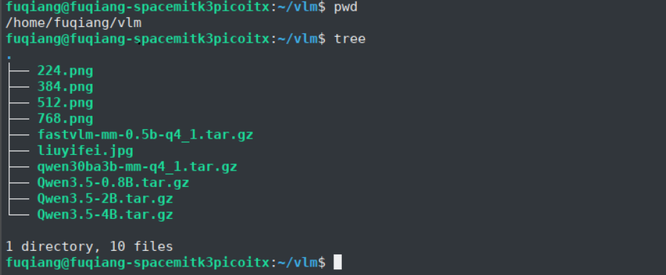
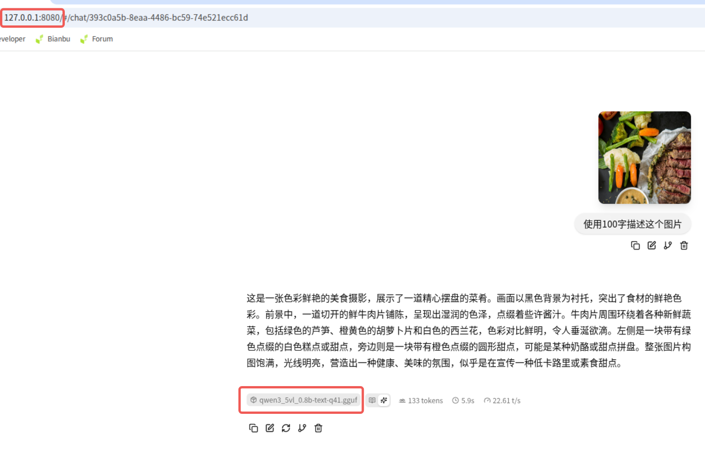
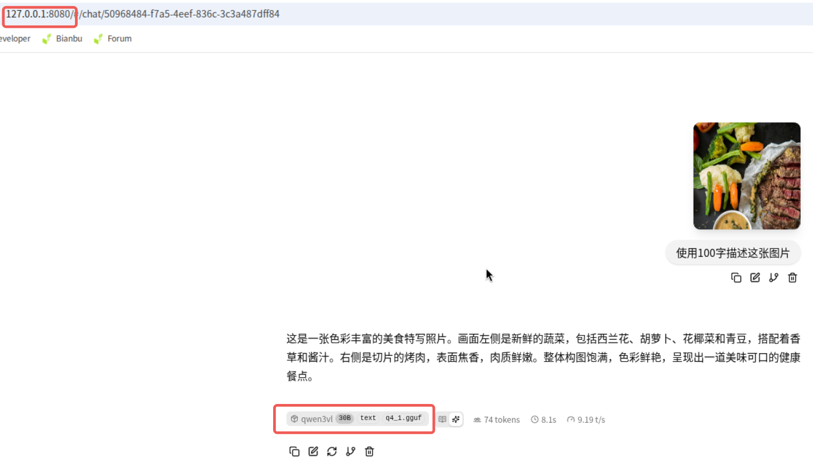

# Llama.cpp


> **llama.cpp** 是一个轻量级大模型推理框架，核心面向 GGUF/GGML 模型的本地推理场景。在 SpacemiT RISC-V 平台上，可以通过 RVV、IME 等硬件能力对 CPU 推理路径进行优化，并可选集成 SMT 视觉扩展以支持多模态场景。([https://github.com/ggml-org/llama.cpp](https://github.com/ggml-org/llama.cpp))

llama.cpp 主要用于在端侧设备上运行大语言模型和多模态模型，具有以下特点：

- 原生支持 GGUF 模型格式，适合部署量化后的 LLM。
- 可通过多线程 CPU 推理快速验证模型可用性与吞吐。
- 在 SpacemiT RISC-V 平台上可启用 RVV 以及 SpacemiT 专用优化开关，以获得更高性能。
- 在开启 SMT 扩展后，可与 SpacemiT ONNXRuntime 组件协同，支持视觉编码等多模态流程。

---

## 平台支持情况

|      平台 & 系统       |       是否支持      |
|-----------------------|-----------------------|
| K1 Buildroot          | ✅ 支持             |
| K1 OpenHarmony5.0     | ❌ 不支持              |
| K3 Bianbu LXQT/GNOME  | ✅ 支持                |
| K3 Buildroot          | ✅ 支持             |
| K3 OpenHarmony5.0     | ❌ 不支持              |
| K3 Bianbu LXQT/GNOME  | ✅ 支持                |

## Bianbu LXQT/GNOME环境使用说明

### 安装

打开终端，执行如下命令安装llama.cpp

```bash
sudo apt update
sudo apt install llama.cpp-tools-spacemit
```

**注意**：一些旧平台或者旧固件没有llama.cpp-tools-spacemit包，可以尝试

```bash
sudo apt update
sudo apt install llama-server
```

### 下载模型

目前支持5种量化格式的模型加速，下载gguf格式模型的时候，主要选择这几种量化格式的模型：
- Q4_K_M
- Q4_0
- Q4_1
- Q2_K
- Q3_K

根据芯片平台的算力下载合适参数的模型，K1平台推荐Qwen3-0.6B，下载方法如下：

```bash
wget https://www.modelscope.cn/models/unsloth/Qwen3-0.6B-GGUF/resolve/master/Qwen3-0.6B-Q4_0.gguf -P ~/
```

K3平台推荐Qwen3-30B-A3B，下载方法如下：

```bash
wget https://www.modelscope.cn/models/unsloth/Qwen3-30B-A3B-Instruct-2507-GGUF/resolve/master/Qwen3-30B-A3B-Instruct-2507-Q4_0.gguf -P ~/
```

### 使用

有3种常见的使用方法
- llama-bench
- llama-cli
- llama-server

下面以K3平台为例，分别介绍

#### llama-bench


```bash
llama-bench -m Qwen3-30B-A3B-Instruct-2507-Q4_0.gguf -t 8 -p 64 -n 64 -mmp 0 -fa 1
```
参数说明：
- -t: 指定运行测试时使用的线程数量（K3:<=8,K1:<=4）
- -p: 指定‌提示词（Prompt）的长度‌，单位为 token
- -n: 指定输出生成长度
- -mmp: 是否启用 Multi-Modal Prompt 支持
- -fa: 是否启用 ‌Flash Attention‌ 功能

输出结果如下：


#### llama-cli

```bash
llama-cli -m Qwen3-30B-A3B-Instruct-2507-Q4_0.gguf -t 8 --no-mmap -c 15360
```

参数说明：
- -m: 指定.gguf格式模型文件的路径
- -t: 指定运行测试时使用的线程数量（K3:<=8,K1:<=4）
- --no-mmap: 禁用内存映射（memory mapping）功能
- -c: 设置‌上下文长度（context size）

输出结果如下：


#### llama-server

启动后台llama-server服务：

```bash
llama-server -m Qwen3-30B-A3B-Instruct-2507-Q4_0.gguf -t 8 --host 127.0.0.1 --port 8080 --ctx-size 15360 --n-gpu-layers 0 --batch-size 512 --metrics --no-mmap &
```

参数说明：
- -m: 指定.gguf格式模型文件的路径
- -t: 指定运行测试时使用的线程数量（K3:<=8,K1:<=4）
- --host: 指定服务器监听的 IP 地址
- --port: 设置服务器监听的端口号，默认为 8080
- --ctx-size: 控制模型上下文长度（以 token 为单位），影响模型处理长文本的能力
- --n-gpu-layers: 指定将模型的多少层卸载到 GPU 上运行以提升推理速度
- --batch-size: 控制一次处理的 token 数量，影响吞吐量和显存使用
- --metrics: 启用 Prometheus 格式的性能监控指标端点 /metrics，便于系统监控和性能分析
- --no-mmap: 禁用内存映射（memory mapping）功能
- -c: 设置‌上下文长度（context size）

##### 本地API请求

```bash
curl -X POST http://127.0.0.1:8080/v1/chat/completions \
  -H "Content-Type: application/json" \
  -d '{
        "model": "Qwen3-30B",
        "messages": [
          { "role": "user", "content": "介绍珠海？" }
        ]
      }'
```

输出结果如下：


##### 浏览器请求

在浏览器中搜索 `http://localhost:8080` 打开 llama 服务器，直接在浏览器中使用 llama.cpp


### 多模态模型下载使用方法

因多模态模型的使用与标准的大语言模型有一些差异，这里单独进行说明。

#### 模型下载

多模态模型需要进迭这边进行拆分才能够在llama.cpp中运行，拆分后的模型下载位置在：https://archive.spacemit.com/spacemit-ai/model_zoo/vlm/，目前比较受欢迎的几个模型为：

- Qwen3.5-0.8B
- Qwen3.5-2B
- Qwen3.5-4B
- fastvlm-0.5B
- Qwen3-VL-30B-A3B

下面以上面几个模型为例，介绍使用方法。

#### 模型准备

下载上面的模型并传递到K3设备中，并准备若干测试图片，图片准备224x224、384x384、512x512、768x768几种分辨率，.png和.jpg格式都可以，如下：



解压模型，以Qwen3.5-0.8B为例，解压后，内容如下：


目录结构说明如下：
- config.json:模型配置文件，下面细说
- qwen3_5vl_0.8b-text-q41.gguf:VLM模型分离出来的大语言模型
- qwen3_5vl_0.8b-vision-224-op23.fp16.onnx:VLM模型分离出来的vision模型，输入224x224
- qwen3_5vl_0.8b-vision-384-op23.fp16.onnx:VLM模型分离出来的vision模型，输入384x384
- qwen3_5vl_0.8b-vision-768-op23.fp16.onnx:VLM模型分离出来的vision模型，输入768x768

config.json配置文件说明：

```bash
{
  "architectures": [
    "Qwen3_5ForConditionalGeneration"
  ],
  "vision_model": {
    "model_path": "./qwen3_5vl_0.8b-vision-384-op23.f16.onnx", //指定vision模型路径
    "input_size": 384,                                         //指定模型输入size，与上面的模型对应
    "spacemit_ep_intra_thread_num": 4,
    "spacemit_ep_inter_thread_num": 1
  },
  "text_model": {
    "model_path": "./qwen3_5vl_0.8b-text-q41.gguf",            //指定大语言模型路径
    "hidden_size": 1024
  }
}
```

#### 模型使用（非Qwen3-vl-30B-A3B）

在Qwen3.5-0.8B目录下通过llama-server命令起service，命令如下：

```bash
llama-server -m qwen3_5vl_0.8b-text-q41.gguf --media-backend smt --smt-config-dir ./ -t 8 --host 0.0.0.0 --port 8080 --reasoning-budget 0 --reasoning off
```
参数说明：
- -m: 指定.gguf格式模型文件的路径
- --media-backend: 
- --smt-config-dir: 
- -t: 指定运行测试时使用的线程数量（K3:<=8,K1:<=4）
- --host: 指定服务器监听的 IP 地址
- --port: 设置服务器监听的端口号，默认为 8080
- --reasoning-budget: 
- --reasoning: 

这个过程中，有一个加载模型的步骤，比较耗时，模型越大越耗时，有如下打印，说明llama-server服务启动成功


打开浏览器，输入网址：127.0.0.1：8080，开始对话，如下：



llama-server的终端会打印出性能指标，如下：


#### 模型使用（Qwen3-VL-30B-A3B）

通过设置 export SPACEMIT_EP_DENSE_ACCURACY_LEVEL=1 加速onnx模型的推理速度

在qwen30ba3b-mm-q4_1目录下通过llama-server起service，命令如下：

```bash
llama-server -m qwen3vl-30b-text-q4_1.gguf --media-backend smt --smt-config-dir ./ -ctk f16 -ctv f16 -t 8 -tb 8 -c 1024 --host 0.0.0.0 --port 8080 --reasoning-budget 0 --reasoning off
```

参数说明：
- -m: 指定.gguf格式模型文件的路径
- --media-backend: 
- --smt-config-dir: 
- -ctk: 
- -ctv:
- -t: 指定运行测试时使用的线程数量（K3:<=8,K1:<=4）
- -tb: 
- -c: 
- --host: 指定服务器监听的 IP 地址
- --port: 设置服务器监听的端口号，默认为 8080
- --reasoning-budget: 
- --reasoning: 

打开浏览器，输入网址：127.0.0.1：8080，开始对话，如下：



llama-server的终端会打印出性能指标，如下：


## Buildroot环境使用说明

### 安装

#### 下载

- 从[这里](https://archive.spacemit.com/spacemit-ai/llama.cpp/)下载进迭官方发布的llama.cpp，并通过scp等方式拷贝到设备上
- 通过wget命令下载（后面以0.0.5版本为例）
```bash
wget http://archive.spacemit.com/spacemit-ai/llama.cpp/spacemit-llama.cpp.riscv64.0.0.5.tar.gz
```
#### 解压

```bash
tar -zxvf spacemit-llama.cpp.riscv64.0.0.5.tar.gz
```

#### 设置LD_LIBRARY_PATH

```bash
export LD_LIBRARY_PATH=/root/spacemit-llama.cpp.riscv64.0.0.5/lib/
```

### 下载模型

根据芯片平台的算力下载合适参数的模型，K1平台推荐Qwen3-0.6B，下载方法如下：

```bash
wget https://www.modelscope.cn/models/unsloth/Qwen3-0.6B-GGUF/resolve/master/Qwen3-0.6B-Q4_0.gguf -P ~/
```

K3平台推荐Qwen3-30B-A3B，下载方法如下：

```bash
wget https://www.modelscope.cn/models/unsloth/Qwen3-30B-A3B-Instruct-2507-GGUF/resolve/master/Qwen3-30B-A3B-Instruct-2507-Q4_0.gguf -P ~/
```

**注意**：如果Buildroot中的wget不支持https路径文件的下载，报（wget: not an http or ftp url:），需要单独下载后通过scp等方式拷贝到设备中

### 使用

有3种常见的使用方法
- llama-bench
- llama-cli
- llama-server

下面以K3平台为例，分别介绍

#### llama-bench


```bash
cd spacemit-llama.cpp.riscv64.0.0.5
./bin/llama-bench -m ../Qwen3-30B-A3B-Instruct-2507-Q4_0.gguf -t 8 -p 64 -n 64
```

输出结果如下：


#### llama-cli

```bash
cd spacemit-llama.cpp.riscv64.0.0.5
./bin/llama-cli -m ../Qwen3-30B-A3B-Instruct-2507-Q4_0.gguf -t 8 --no-mmap -c 15360
```

输出结果如下：


#### llama-server

启动后台llama-server服务：

```bash
./bin/llama-server -m ../Qwen3-30B-A3B-Instruct-2507-Q4_0.gguf -t 8 --host 127.0.0.1 --port 8080 --ctx-size 15360 --n-gpu-layers 0 --batch-size 512 --metrics --no-mmap &
```

##### 本地API请求

```bash
curl -X POST http://127.0.0.1:8080/v1/chat/completions \
  -H "Content-Type: application/json" \
  -d '{
        "model": "Qwen3-30B",
        "messages": [
          { "role": "user", "content": "introduce zhuhai？" }
        ]
      }'
```

**注意**：Buildroot未安装curl，暂未验证

## 本地构建

SpacemiT RISC-V 平台构建时，建议开启 `GGML_CPU_RISCV64_SPACEMIT` 选项以启用相关优化。

```bash
export RISCV_ROOT_PATH=/path/to/spacemit-toolchain-linux-glibc-x86_64-v1.1.2

cmake -B build \
    -DCMAKE_BUILD_TYPE=Release \
    -DGGML_CPU_RISCV64_SPACEMIT=ON \
    -DGGML_CPU_REPACK=OFF \
    -DLLAMA_OPENSSL=OFF \
    -DGGML_RVV=ON \
    -DGGML_RV_ZVFH=ON \
    -DGGML_RV_ZFH=ON \
    -DGGML_RV_ZICBOP=ON \
    -DGGML_RV_ZIHINTPAUSE=ON \
    -DGGML_RV_ZBA=ON \
    -DCMAKE_TOOLCHAIN_FILE=${PWD}/cmake/riscv64-spacemit-linux-gnu-gcc.cmake \
    -DCMAKE_INSTALL_PREFIX=build/installed

cmake --build build --parallel $(nproc) --config Release

pushd build
make install
popd
```

## 多模态扩展构建

如果需要在 `llama-server` 或 `llama-mtmd-cli` 中启用 SpacemiT SMT 多模态扩展，需要额外准备一个 `SPACEMIT_ORT_DIR` 目录，其中至少包含：

- `include/`
- `lib/`
- `samples/`

构建时增加以下定义：

```bash
export SPACEMIT_ORT_DIR=/path/to/spacemit-ort
export LD_LIBRARY_PATH=${SPACEMIT_ORT_DIR}/lib:${LD_LIBRARY_PATH}

cmake -B build \
    -DCMAKE_BUILD_TYPE=Release \
    -DGGML_CPU_RISCV64_SPACEMIT=ON \
    -DGGML_CPU_REPACK=ON \
    -DLLAMA_OPENSSL=OFF \
    -DGGML_RVV=ON \
    -DGGML_RV_ZVFH=ON \
    -DGGML_RV_ZFH=ON \
    -DGGML_RV_ZICBOP=ON \
    -DGGML_RV_ZIHINTPAUSE=ON \
    -DGGML_RV_ZBA=ON \
    -DCMAKE_TOOLCHAIN_FILE=${PWD}/cmake/riscv64-spacemit-linux-gnu-gcc.cmake \
    -DCMAKE_INSTALL_PREFIX=build/installed \
    -DLLAMA_SERVER_SMT_VISION=ON \
    -DSPACEMIT_ORT_DIR=${SPACEMIT_ORT_DIR}
```

运行 `llama-server` 时需要额外传入 SMT 配置目录：

```bash
export LD_LIBRARY_PATH=/path/to/spacemit-ort/lib:./build/installed/lib:${LD_LIBRARY_PATH}

./build/bin/llama-server \
  -m /path/to/model.gguf \
  --media-backend smt \
  --smt-config-dir /path/to/smt-config-dir \
  -t 8 -c 16384 --no-mmap -ub 128 --warmup
```

`--smt-config-dir` 目录下通常需要包含 `config.json` 以及对应的视觉 ONNX 模型文件。

## [模型性能数据](./modelzoo.md)
> 通过llama-bench测试获得