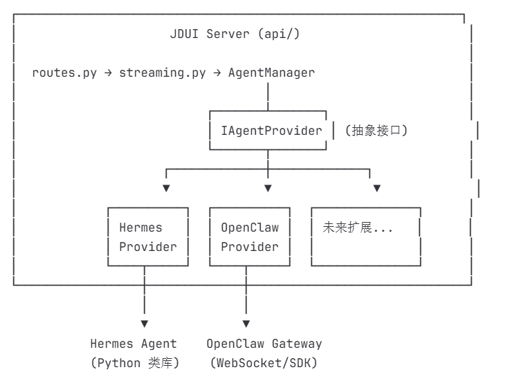
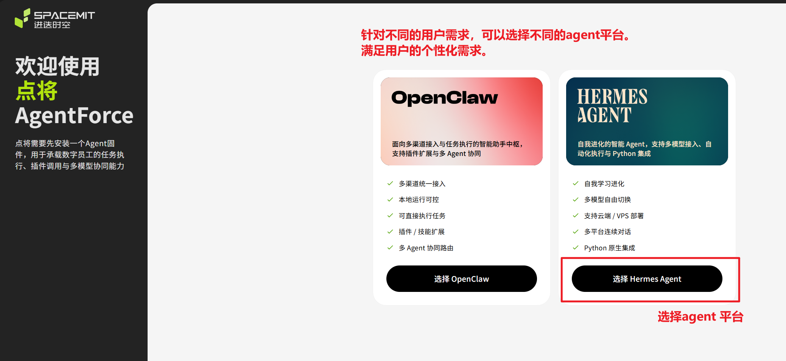
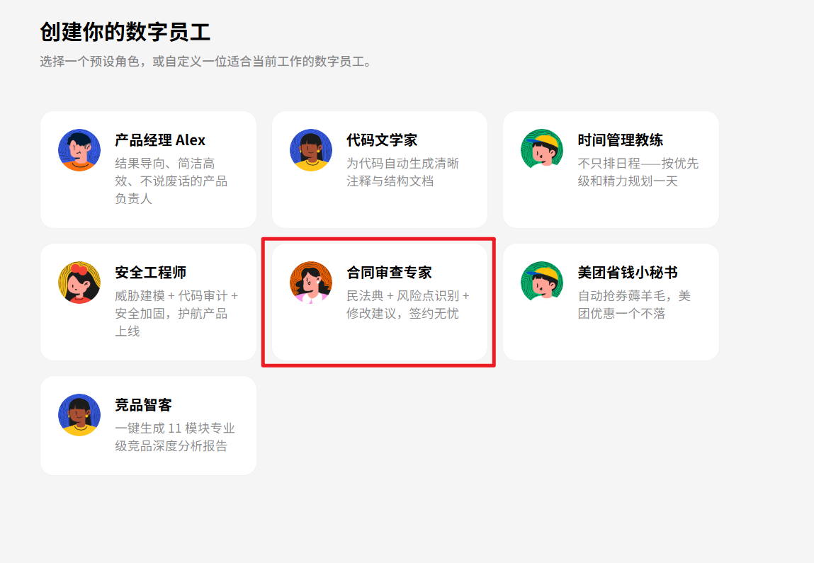
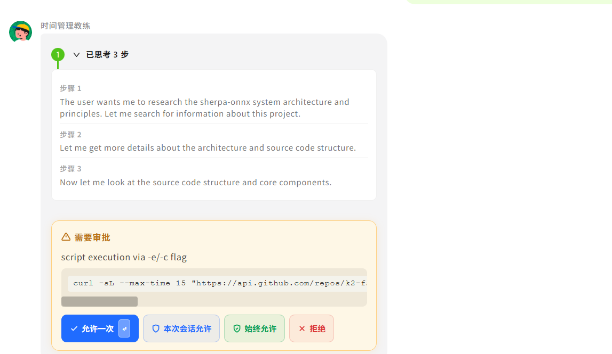

<!--
 * Copyright 2022-2023 SPACEMIT. All rights reserved.
 * Use of this source code is governed by a BSD-style license
 * that can be found in the LICENSE file.
 * 
 * @Author: David(qiang.fu@spacemit.com)
 * @Date: 2026-05-12 20:12:39
 * @LastEditTime: 2026-05-16 00:00:00
 * @FilePath: \doc\docs-ai\zh\solutions\aicomputer_solution\agentforce.md
 * @Description: 
-->
sidebar_position: 4

# 点将(AgentForce)

**AgentForce（点将）** 是一个基于 Hermes Agent 和 OpenClaw 的 AI 数字员工管理平台，提供可视化的 Web 界面，让用户轻松创建、管理和与多个 AI 数字员工进行对话。每个数字员工拥有独立的性格、记忆和技能，可以自主学习并执行任务。

## 平台支持情况

| 平台 & 系统           | 是否支持  |
| --------------------- | --------- |
| K1 Buildroot          | ❌ 不支持 |
| K1 OpenHarmony        | ❌ 不支持 |
| K1 Bianbu LXQT/GNOME  | ✅ 支持   |
| K3 Buildroot          | ❌ 不支持 |
| K3 OpenHarmony        | ❌ 不支持 |
| K3 Bianbu LXQT/GNOME  | ✅ 支持   |

## 产品特点

- **数字员工管理**：创建、编辑、删除 AI 数字员工，每个员工拥有独立的性格、记忆和技能
- **7 种员工模板**：产品经理、代码文档员、日程管理员、安全工程师、合同审查员、美团优惠券助手、竞品情报分析师
- **多员工并行**：同时管理多个数字员工，一键切换
- **流式对话**：基于 SSE 的实时流式响应，支持工具调用和审批流程
- **多模型支持**：兼容 OpenAI、Anthropic、MiniMax、Kimi、OpenRouter 及自定义端点
- **定时任务**：数字员工可在后台执行定时任务并推送结果 [comeing soon]
- **文件管理**：内置工作区文件浏览器，支持预览、编辑和上传
- **自主学习**：员工自动积累记忆和技能，跨会话保持上下文

## 技术架构

AgentForce 采用前后端分离架构：



```
浏览器（Vue 3 + Vite 前端）
    ↓ HTTP REST + SSE
Node.js 服务（端口 8881）— 静态文件服务 + API 代理
    ↓ HTTP REST
Python 后端（端口 8787）— AgentForce WebUI
    ↓ Python 调用
Hermes Agent / OpenClaw（AI 引擎）
    ↓ API 调用
LLM 服务商（OpenAI / Anthropic / MiniMax 等）
```

**后端**：Python 3.12+，使用标准库 HTTPServer，无框架依赖，轻量高效

**前端**：Vue 3 + Vite（TypeScript），UI 组件库 Ant Design Vue

**通信协议**：HTTP REST 用于 CRUD 操作，SSE 用于实时流式响应

**数据存储**：本地 JSON 文件，无需数据库

## 安装

### 方式一：apt 安装（推荐）

在 Bianbu OS 上直接通过 apt 安装：

```bash
sudo apt update
sudo apt install bianbu-agentforce
```

安装完成后服务自动启动，通过浏览器访问 `http://127.0.0.1:8881` 即可使用。

### 方式二：源码安装（开发者）

适用于需要修改代码或参与开发的场景。

#### 1. 克隆仓库

```bash
git clone git@gitlab.dc.com:bianbu/ai/agentforce.git
cd agentforce
git checkout hermesClaw
```

#### 2. 安装依赖

```bash
pip3 install -r requirements.txt
```

#### 3. 启动服务

```bash
# 本地访问
python3 server.py

# 局域网访问
HERMES_WEBUI_HOST=0.0.0.0 python3 server.py

# 带访问密码
HERMES_WEBUI_HOST=0.0.0.0 HERMES_WEBUI_PASSWORD=your-secret python3 server.py
```

## 首次使用：引导式安装向导

首次访问 `http://127.0.0.1:8787` 时，AgentForce 安装向导会自动启动，引导完成以下配置：

1. **选择 Agent 平台** — 选择 Hermes Agent 或 OpenClaw
2. **环境检测与安装** — 自动检测安装状态，支持一键安装（需输入 sudo 密码）
3. **配置模型引擎** — 选择 Spacemit Engine 或自定义 API
4. **选择员工模板** — 从 7 种预设模板中选择
5. **自定义员工** — 编辑名称、描述和 emoji 头像
6. **确认配置** — 查看配置摘要，开启/关闭能力开关
7. **完成** — 自动跳转到员工对话页面

## 数字员工模板

| 模板 | 头像 | 适用场景 |
| ---- | ---- | -------- |
| 产品经理 | 🧑‍💼 | 需求分析、产品规划、用户调研 |
| 代码文档员 | 🧑‍💻 | 代码注释、文档生成、架构说明 |
| 日程管理员 | 📅 | 日程规划、提醒、时间管理 |
| 安全工程师 | 🔒 | 代码审计、漏洞检测、安全建议 |
| 合同审查员 | 📄 | 合同条款分析、风险识别 |
| 美团优惠券助手 | 🍔 | 优惠券信息查询与推送 |
| 竞品情报分析师 | 🔍 | 竞品分析、市场调研 |

每个员工均可自定义名称、描述、头像，以及以下能力开关：

| 能力 | 说明 |
| ---- | ---- |
| 联网搜索 | 访问互联网获取实时信息 |
| 长期记忆 | 跨会话保留用户偏好和上下文 |
| 自主执行 | 执行终端命令（需审批） |
| 知识库集成 | 读写工作区文件 |

## 配置

### 环境变量

| 变量 | 默认值 | 说明 |
| ---- | ------ | ---- |
| `HERMES_WEBUI_HOST` | `127.0.0.1` | 监听地址，`0.0.0.0` 开启局域网访问 |
| `HERMES_WEBUI_PORT` | `8787` | 后端端口 |
| `HERMES_WEBUI_PASSWORD` | 无 | 访问密码（可选） |
| `HERMES_WEBUI_STATE_DIR` | `~/.hermes/webui` | 数据存储目录 |
| `HERMES_HOME` | `~/.hermes` | Hermes 主目录 |

### 模型配置

**Hermes Agent 模式**，编辑 `~/.hermes/profiles/emp-xxx/config.yaml`：

```yaml
model:
  default: MiniMax-M2.7-highspeed
  provider: custom
  base_url: https://api.minimaxi.com/v1
  api_mode: chat_completions

custom_providers:
- name: minimax-cn
  base_url: https://api.minimaxi.com/v1
  api_key: your_key_here
  api_mode: chat_completions
  model: MiniMax-M2.7-highspeed
```

API Key 存放在同目录的 `.env` 文件中：

```env
MINIMAX_CN_API_KEY=your_key_here
MINIMAX_CN_BASE_URL=https://api.minimaxi.com/v1
```

### 支持的 LLM 服务商

| 服务商 | 环境变量 |
| ------ | -------- |
| OpenAI | `OPENAI_API_KEY` |
| Anthropic | `ANTHROPIC_API_KEY` |
| MiniMax（国际） | `MINIMAX_API_KEY` |
| MiniMax（国内） | `MINIMAX_CN_API_KEY` |
| Kimi / Moonshot | `KIMI_API_KEY` |
| OpenRouter | `OPENROUTER_API_KEY` |
| 自定义 OpenAI 兼容端点 | 在 config.yaml 中配置 |

## 主界面功能

- **员工面板**：列表展示所有数字员工，支持新增、编辑、删除
- **对话界面**：与选中员工进行实时流式对话，内联展示工具调用进度
- **审批流程**：对危险操作（终端命令、文件写入）弹出审批确认
- **会话管理**：查看历史会话，支持搜索、归档、导出
- **文件浏览器**：工作区文件管理，支持预览和编辑
- **技能与记忆**：查看和管理员工积累的技能和长期记忆
- **定时任务**：创建和监控后台定时任务

## 使用教程：K3 pico-ITX Bianbu OS LXQT 安装使用

本教程以 K3 pico-ITX 开发板 Bianbu OS LXQT 为例，演示完整的安装与使用流程。

### 第一步：安装 AgentForce

> **注意**：当前通过公司内部源安装，需要确保已配置内部源：`https://archive.bianbu.xyz/bianbu4` 对外发布后可直接安装

打开终端，执行安装命令：

```bash
sudo apt update
sudo apt install bianbu-agentforce
```

等待安装完成。相比原生 agent 手动安装，apt 方式更简易上手，全程自动化。

### 第二步：打开 AgentForce

安装完成后，在浏览器中访问：

```
http://127.0.0.1:8881/#/onboarding
```

页面将进入引导式安装向导。


### 第三步：安装 Agent 包

向导会自动检测 Agent 运行环境。如尚未安装，点击 **安装** 按钮，输入 sudo 密码以授权安装 `hermes-agent` 包。

等待安装完成（约 1~3 分钟，页面实时显示安装日志）。


### 第四步：配置模型

填入 LLM 服务的 API 信息。可使用以下演示 API Key 快速体验：

| 项目 | 值 |
| ---- | -- |
| API Key | `sk-cp-vkEj751v_1aM***********************************` |
| Base URL | `https://api.minimax.com/v1` |
| Model Name | `MiniMax-M2.7` |

> 填入你自己的 API Key，或者直接留空点击 **下一步**，系统会自动分配默认 API Key 用于 demo 体验。


### 第五步：选择并定制数字员工

从 7 种预设模板中选择一个角色，也可自定义名称、描述和头像，打造专属数字员工。



### 第六步：开始对话

进入对话页面后，即可向数字员工发送任务。Agent 会持续探索解决方案，直到完成任务或遇到需要人工确认的操作。


**权限管控（审批功能）**：当 Agent 需要执行终端命令等敏感操作时，会弹出审批确认框，可选择"仅此一次允许"、"本次会话允许"或"拒绝"。



> 如遇到流式输出失败的情况，可能是前端存在潜在 bug，请反馈到 issue 区。

### 实践场景示例

以下为不同角色的典型使用场景，可根据自身需求参考实践：

**产品经理**

> Q：帮我对某竞品做一次竞品调研，输出分析报告

**测试工程师**

> Q：帮我分析这段代码的边界情况并生成测试用例

**文档工程师**

> Q：帮我根据以下代码生成 API 参考文档

**程序员 — 场景 1：调研开源项目**

> Q：帮我调研一下 sherpa-onnx 的系统架构、原理

**程序员 — 场景 2：调研硬件平台**

> Q：帮我调研一下 Spacemit K3 A100 的 AI 指令和编程 example、系统架构、原理、硬件结构

### 常见问题

**上下文接近上限**

对话进行到一定深度后，页面会提示"⚠ 上下文接近上限，即将整理记忆"。此时等待 1~3 分钟，Agent 会自动压缩上下文，压缩完成后可继续对话，无需重新开始。

**遇到问题**

如果使用中碰到问题，请在项目 issue 区反馈，会及时跟进处理。
